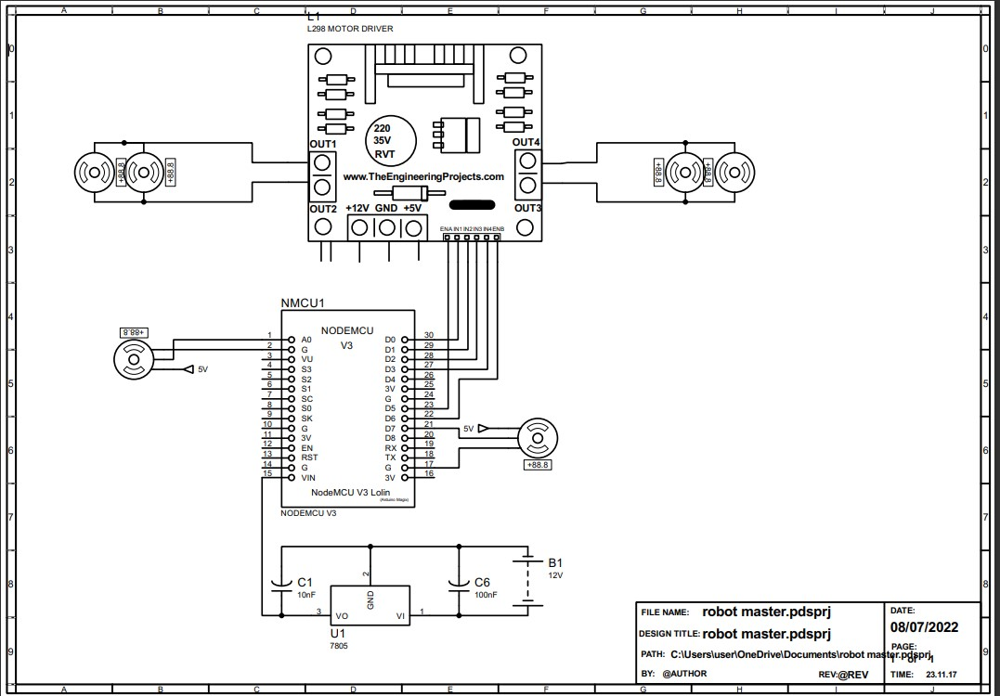

# KRTMI Program KRI

Persiapan KSM Mekatronika dalam menghadapi perlombaan lomba dam catur KRTMI robot kain, desain alat terbagi menjadi dua yakni, desain remote dan desain robot, untuk desain robot:

## Desain Remote
Alat-alat yang dibutuhkan pada desain remote adalah :
1. ESP8266
2. Lipo 7.4V
3. LM7805
4. Capacitor 100nF, 10nF
5. Push Button
6. Potentiometer
7. LED
8. Switch

## Desain Robot
Alat-alat yang dibutuhkan pada desain robot adalah :
1. ESP8266
2. Lipo 7.4V
3. LM7805
4. Capacitor 100nF, 10nF
5. Servo
7. PCA9685
8. Motor DC
9. Roda
10. Capit
11. PCB
12. l298n motor driver
13. Switch

## Saran
1. menggunakan ESP32 karena memiliki analog pin yang tidak dimiliki oleh ESP8266
2. Capit harus menggenggam koin dengan posisi sejajar 
3. desain baterai lipo diperbesar dan diperbagus 